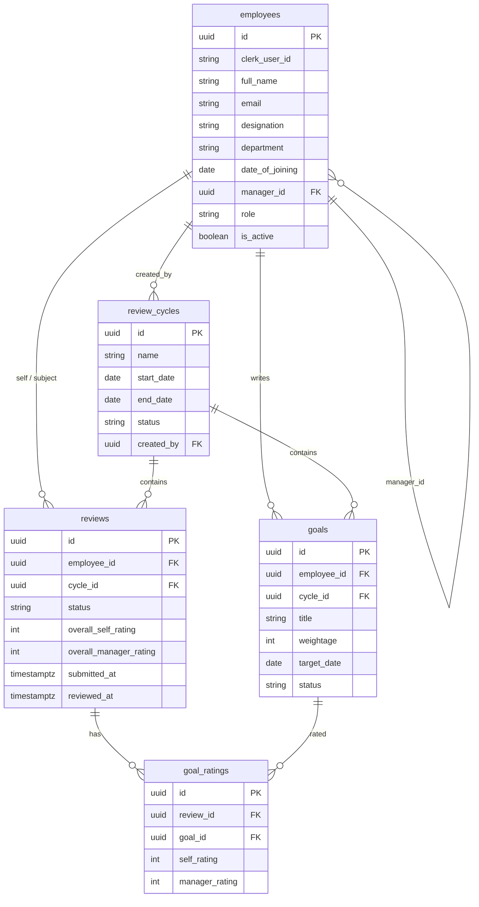

# Merit

Performance management for a ~200-person services company.

Spreadsheets and one-off Word forms do not scale when every employee needs goals, a self-appraisal, a manager review, and a company-wide completion picture. **Merit** is a role-aware appraisal product: employees set weighted goals, managers approve them and complete reviews, and HR runs cycles with live completion metrics.

**Live demo:** [https://pms-app.vercel.app](https://pms-app.vercel.app)

Source: [github.com/josejrestrada/pms-app](https://github.com/josejrestrada/pms-app)

---

## Tech stack

| Layer | Choice |
| --- | --- |
| App | Next.js 16 App Router, React 19, TypeScript |
| UI | Tailwind CSS v4 |
| Auth | Clerk (`proxy.ts` + `@clerk/nextjs`) |
| Data | Supabase (Postgres) |
| Email | Resend (manager notify after self-appraisal) |
| Hosting | Vercel |

---

## Data model

Employees form a **self-referencing hierarchy**: `employees.manager_id` points at another row in `employees`. Direct reports are `WHERE manager_id = :logged_in_employee_id`. Managers may only open `/manager/review/[id]` when that review’s employee has `manager_id` equal to their own id.



**Roles:** `employee` · `manager` · `hr_admin`

**Typical cycle flow**

1. HR opens a `review_cycles` row (`status = open`).
2. Employee drafts goals (`weightage` must total 100%) and submits them.
3. Manager approves or sends back (`approved` / `sent_back`).
4. Employee submits self-appraisal (`reviews.status = self_submitted`); Resend emails the manager.
5. Manager completes the review (`status = completed`).

---

## Run locally

### 1. Clone and install

```bash
git clone https://github.com/josejrestrada/pms-app.git
cd pms-app
npm install
```

### 2. Create `.env.local`

Copy this template into `.env.local` at the repo root (never commit real keys):

```bash
# Clerk
NEXT_PUBLIC_CLERK_PUBLISHABLE_KEY=pk_test_...
CLERK_SECRET_KEY=sk_test_...
NEXT_PUBLIC_CLERK_SIGN_IN_URL=/sign-in
NEXT_PUBLIC_CLERK_SIGN_UP_URL=/sign-up
NEXT_PUBLIC_CLERK_SIGN_IN_FALLBACK_REDIRECT_URL=/dashboard
NEXT_PUBLIC_CLERK_SIGN_UP_FALLBACK_REDIRECT_URL=/dashboard

# Supabase
NEXT_PUBLIC_SUPABASE_URL=https://YOUR_PROJECT.supabase.co
NEXT_PUBLIC_SUPABASE_ANON_KEY=eyJ...

# Resend (manager email after self-appraisal)
RESEND_API_KEY=re_...
RESEND_FROM_EMAIL=Merit <onboarding@resend.dev>
```

In Clerk, allow `http://localhost:3000` as an origin and match the sign-in/sign-up URLs above.

### 3. Database

In Supabase, create tables that match the model above (`employees`, `review_cycles`, `goals`, `reviews`, `goal_ratings`). Seed at least:

- An HR admin whose `email` matches your Clerk user
- A manager with `role = manager`
- An employee whose `manager_id` is that manager’s `id`

### 4. Start the app

```bash
npm run dev
```

Open [http://localhost:3000](http://localhost:3000), sign in, and you should land on `/dashboard`.

```bash
npx tsc --noEmit   # same TypeScript check Vercel uses
```

---

## App map

| Route | Who | Purpose |
| --- | --- | --- |
| `/dashboard` | All | Role-aware status, metrics, CSV (HR) |
| `/goals` | Employees | Set goals; locked without an open cycle |
| `/review/self` | Employees | Self-appraisal on approved goals |
| `/manager/goals` | Managers | Approve / send back team goals |
| `/manager/review` | Managers | Queue of submitted appraisals |
| `/manager/review/[id]` | Managers | Side-by-side manager review (direct reports only) |
| `/admin/employees` | HR | Directory |
| `/admin/cycles` | HR | Draft / open / close cycles |

Unauthorized URLs redirect to `/dashboard` with an alert.
