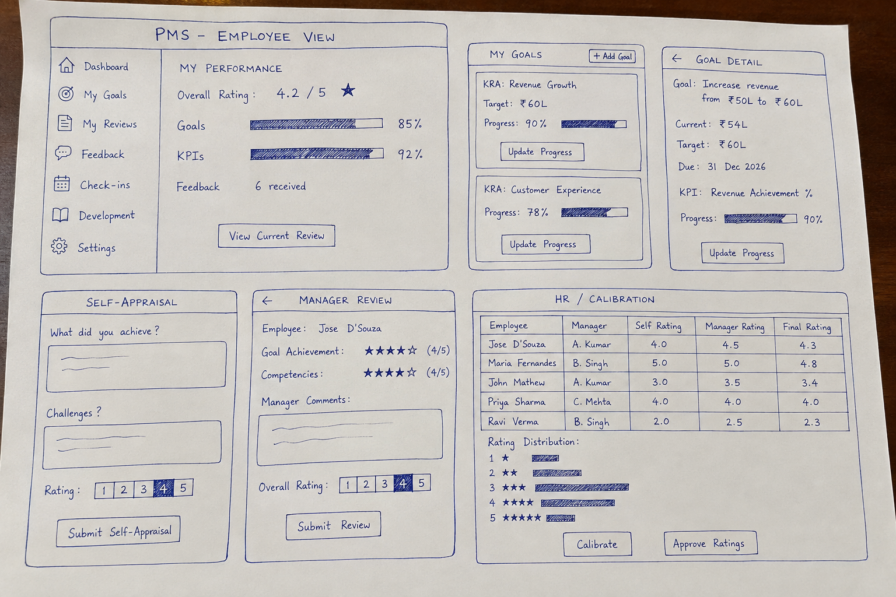

# Performance Management System — Research Note

## 1. KRA, KPI and Goal

A **KRA (Key Result Area)** is a broad area of responsibility in which an employee is expected to deliver results. It answers the question: **“What important area of my job am I responsible for?”**

A **KPI (Key Performance Indicator)** is a measurable indicator used to evaluate performance in that area. It answers: **“How will we know whether I am performing well?”**

A **goal** is a specific result an employee commits to achieving within a defined period. It answers: **“What exactly do I want or need to accomplish?”**

For example, for a **Sales Manager**:

| Concept | Example                                                                   |
| ------- | ------------------------------------------------------------------------- |
| KRA     | Revenue Growth                                                            |
| KPI     | Monthly sales revenue / achievement percentage                            |
| Goal    | Increase monthly sales revenue from ₹50 lakh to ₹60 lakh by December 2026 |

The three concepts therefore work together. The KRA defines the responsibility area, the KPI measures performance, and the goal defines a specific target.

## 2. SMART Goals

SMART is a framework for writing clearer goals:

**S — Specific:** Clearly states what needs to be achieved.  
**M — Measurable:** Has a way of determining progress or success.  
**A — Achievable:** Realistic given the employee's resources and responsibilities.  
**R — Relevant:** Connected to the employee's role and organisational priorities.  
**T — Time-bound:** Has a deadline or defined period.

For example, “Improve customer service” is a badly written goal because it is vague, has no measurement, no clear target and no deadline.

A better version would be: **“Increase the customer satisfaction score from 82% to 90% by 31 December 2026.”**

A goal can technically be measurable but still be poorly designed. For example, “Make 1,000 customer calls” measures activity but may not measure meaningful business results. A good PMS should therefore encourage goals that measure meaningful outcomes rather than simply creating busywork.

## 3. Performance Appraisal Cycle

A performance appraisal cycle is the structured process through which an organisation sets expectations, monitors performance, gathers evidence and evaluates an employee's performance over a defined period.

A typical cycle is:

**Goal Setting → Regular Check-ins → Self-Appraisal → Manager Appraisal → Calibration → Final Review → Development/Next Goals**

At the **goal-setting stage**, the employee and manager agree on expectations and targets. HR normally designs the framework and timelines.

During **check-ins**, the employee provides progress updates and raises challenges, while the manager provides coaching, feedback and support.

During **self-appraisal**, the employee reflects on achievements, challenges and development. The manager then completes the **manager appraisal**, using goals, feedback, evidence and observed behaviours.

In the **calibration stage**, managers and HR compare ratings across teams to check whether similar standards have been applied. Calibration is intended to reduce differences between very strict and very lenient managers. SHRM describes calibration as a way of creating a more consistent “yardstick” across managers.

Finally, the review is discussed with the employee and the organisation moves into development planning, recognition, compensation decisions where applicable, and the next performance cycle.

Modern PMS products increasingly combine formal reviews with continuous feedback and regular conversations rather than treating performance as a once-a-year event. Culture Amp, for example, combines goals, 1-on-1s, continuous feedback, reviews and calibration.

## 4. Self-Appraisal

A **self-appraisal** is an employee's own assessment of their performance before or alongside the manager's assessment.

Organisations ask employees to complete self-appraisals because employees have information that managers may not see. An employee can explain completed projects, obstacles, additional responsibilities, learning, achievements and circumstances affecting performance.

It also gives the employee a voice in the appraisal process. The manager can compare the employee's perception with their own assessment and use differences as a starting point for discussion.

For example, if an employee rates themselves highly on stakeholder management but the manager rates them lower, the difference can lead to a useful conversation rather than simply producing a score.

Modern systems such as Culture Amp explicitly include self-reflections as part of their performance cycle, alongside peer, upward and manager feedback.

## 5. Rating Scales

A rating scale converts an assessment of performance into standardised categories.

### 3-point scale

Example:

1. Needs Improvement
2. Meets Expectations
3. Exceeds Expectations

**Advantage:** Simple and easy to understand.  
**Disadvantage:** Provides limited differentiation between employees.

### 4-point scale

Example:

1. Needs Significant Improvement
2. Partially Meets Expectations
3. Meets Expectations
4. Exceeds Expectations

**Advantage:** Forces the evaluator to make a clearer choice and removes a neutral middle point.  
**Disadvantage:** Someone who genuinely performs at the expected level may feel forced to choose between “partially meets” and “exceeds.”

### 5-point scale

Example:

1. Unsatisfactory
2. Needs Improvement
3. Meets Expectations
4. Exceeds Expectations
5. Exceptional

**Advantage:** Provides greater differentiation and includes a clear “meets expectations” level.  
**Disadvantage:** Managers may interpret the middle rating differently, and employees sometimes perceive a “3” as mediocre even when it actually means successful performance.

SHRM notes that 3-point and 5-point scales are common and highlights the problem of employees interpreting a middle score as mediocre even when the organisation intends it to mean solid performance.

Some organisations avoid a middle option because it can become an easy “safe” choice. If managers consistently select the middle option, ratings may provide little useful differentiation. However, removing the middle option can also create a problem: employees who genuinely meet expectations may be pushed artificially toward either positive or negative ratings.

For a student PMS, a **5-point scale** is probably the easiest to demonstrate because it clearly shows progression from poor performance to exceptional performance.

## 6. Normalisation, Calibration and the Bell Curve

**Calibration** is the process of comparing performance assessments across managers or teams to ensure that similar standards are being applied.

For example, Manager A may rate most employees as “Exceeds Expectations” because they are relatively lenient, while Manager B may rarely give that rating because they are stricter. Calibration allows managers and HR to discuss these differences.

**Normalisation** is the broader idea of making ratings more comparable across groups. It can involve reviewing rating distributions, checking for inconsistencies and identifying unusual patterns.

The **bell curve** or forced distribution approach assumes that employee performance should follow a distribution where a small proportion are high performers, most employees are in the middle, and a small proportion are low performers.

A simplified example might be:

- 10% — Outstanding
- 20% — Exceeds Expectations
- 60% — Meets Expectations
- 10% — Needs Improvement

The bell curve is controversial because performance does not necessarily naturally follow a statistical distribution. A team could genuinely contain many high performers, especially if the hiring and management systems are strong.

Forced ranking can also encourage unhealthy competition, discourage collaboration and cause employees to be rated against colleagues rather than against clearly defined expectations.

Therefore, a modern PMS should use **calibration to improve consistency**, rather than automatically forcing every organisation into a bell-curve distribution.

## 7. OKRs vs Traditional KRA-Based Appraisals

**OKR** means **Objectives and Key Results**.

An Objective describes what the organisation or employee wants to accomplish, while Key Results define measurable evidence that the objective has been achieved.

For example:

**Objective:** Improve customer retention.

**Key Results:**

- Increase customer retention from 82% to 90%.
- Reduce monthly churn from 5% to 3%.
- Increase repeat purchases by 15%.

Traditional **KRA-based appraisal** starts with the employee's responsibilities and evaluates whether the employee performed successfully within those areas.

The key difference is that KRA-based systems are often more focused on **role responsibilities and evaluation**, whereas OKRs are more focused on **strategic alignment, priorities and measurable outcomes**.

KPIs are generally ongoing measures of performance, while OKRs are typically used to define and pursue specific objectives during a period.

The two approaches do not have to compete. A PMS can use KRAs to define an employee's responsibility areas, KPIs to measure ongoing performance, and OKRs/goals to define important priorities for the period.

15Five, for example, allows employees to connect individual goals to company OKRs and track progress through regular check-ins.

## 8. Existing PMS Products

Three real performance management products are **Workday**, **Culture Amp**, and **15Five**.

### Workday

Workday's performance functionality connects goals, feedback, development items and competencies with formal employee reviews. Goals can be incorporated into employee reviews and evaluated as part of the review process.

Typical areas include:

- Employee/worker profile
- Goals
- Feedback
- Performance reviews
- Competencies
- Development
- Manager/team views

**What I like:** The strong connection between employee goals and formal reviews.

**What I dislike:** It is designed as a broad enterprise HR platform, so a student-built PMS inspired directly by it could become unnecessarily complex.

### Culture Amp

Culture Amp has a more modern performance-management approach. Its main areas include **Goals, Reviews, Feedback, 1-on-1s and Development**. It also supports self-reflections, peer feedback, manager reviews and calibration.

**What I like:** The clear emphasis on continuous performance rather than only annual appraisal. Its navigation also makes the relationship between goals, feedback and reviews easy to understand.

**What I dislike:** The platform contains many features beyond what a small PMS requires.

### 15Five

15Five focuses heavily on continuous performance. Its system includes **Check-ins, 1-on-1s, Goals/OKRs, Reviews, Feedback and Assessments**. Weekly check-ins can track goals and surface challenges before the formal review.

**What I like:** The idea of making performance management continuous rather than waiting until the end of the year.

**What I dislike:** Its philosophy is more heavily oriented toward continuous check-ins and OKRs, which may not fit organisations that primarily use traditional KRA/KPI appraisal structures.

These products suggest that a good PMS should not be just a “rating form.” It should connect **goals → progress → feedback → appraisal → development**.

## 9. Sensitive PMS Data

Performance management systems contain highly sensitive employee information.

Examples include:

- Performance ratings
- Manager comments
- Self-appraisals
- Peer feedback
- 360-degree feedback
- Development weaknesses
- Disciplinary or performance concerns
- Promotion recommendations
- Compensation information
- Calibration discussions
- Potential/leadership assessments
- Employee career aspirations
- Personal information connected to performance

Access should follow the principle of **least privilege**.

An employee should normally see their own goals, self-appraisal and the feedback/review information that the organisation has decided to share with them.

A manager should see information relating to their direct reports when required for their role.

HR or authorised administrators may need broader access for managing the performance process and calibration.

Employees should **never be able to see another employee's confidential appraisal, manager-only comments, compensation information, calibration discussions or private HR records**.

Likewise, a manager should not automatically have access to confidential performance information about employees outside their reporting line.

Workday's documentation illustrates this role-based approach: access to performance reviews is controlled through security domains and roles such as managers, HR partners and administrators.

1. PMS Screen Sketches
  

